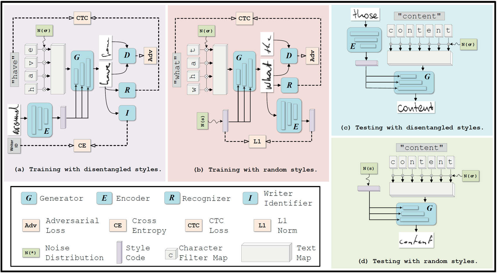
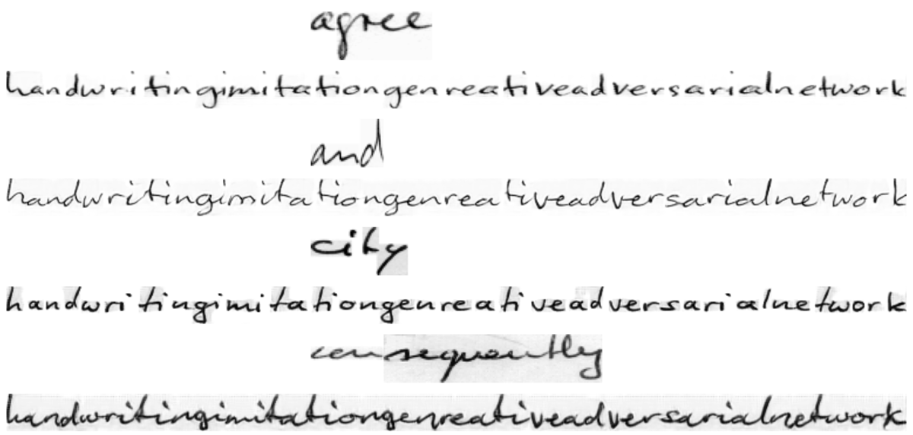
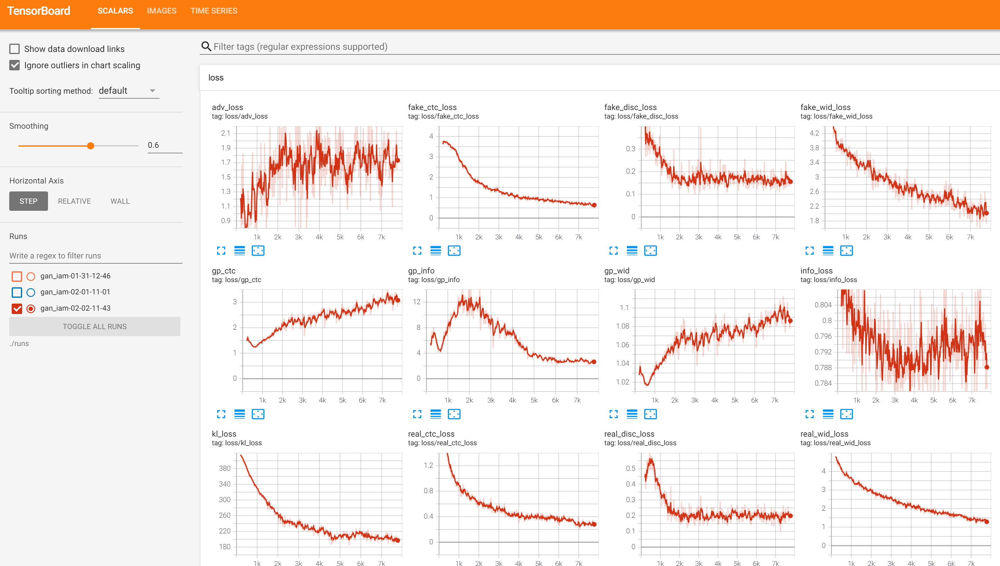
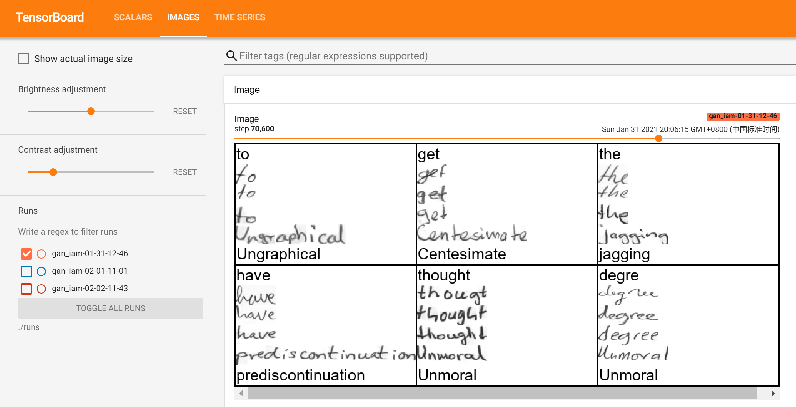

# HiGAN

## Introduction
This is a PyTorch implementation of the paper **"HiGAN: Handwriting Imitation Conditioned on Arbitrary-Length Texts and Disentangled Styles"**.

## Overview of HiGAN

## Installation & requirements
The current version of the code has been tested with the following environment:
- Ubuntu16 or 18
- CPU or NVIDIA GPU + CUDA cuDNN 10.0
- Python 3
- PyTorch 1.1.0+

The versions that were used for other Python-packages are listed in requirements.txt.

To use the code, download the repository and change into it:

`git clone https://github.com/ganji15/HiGAN.git`

`cd HiGAN`

Assuming Python and pip are set up, the Python-packages used by this code can be installed using:

`pip install -r requirements.txt`

You need to applicant the IAM dataset from <http://www.fki.inf.unibe.ch/databases/iam-handwriting-database> and then extract the handwriting images. For convenience, here we provide the processed h5py files [trnvalset_words32.hdf5](https://drive.google.com/file/d/1K6nNcQ-4_MiPiaOUdXi80x5fVlheXbYM/view), [testset_words32.hdf5](https://drive.google.com/file/d/121wcainZweuXqCFyh5Q0WV3qb2SmNdBS/view), [testset_words32d_OrgSz.hdf5](https://drive.google.com/file/d/1vNbSiz7S60fvpj6-4k0fzHwx2uHDv0_0/view?usp=sharing), which should put into the **./data/** directory.

## Training & Test
### Training HiGAN on the IAM dataset
`python main.py --config ./configs/gan_iam.yml`

### Quantitative Test
`python test.py --config ./configs/gan_iam.yml --ckpt ./runs/gan_iam-02-02-11-43/ckpts/last.pth --guided True`
+ Main arguments:
  - `--config`: the configuration file of HiGAN
  - `--ckpt`: the path of checkpoint, which is stored in the `./runs/` directory after training.
  - `--guided`: whether to extract styles from reference images. If `--guided False`, the styles of generated images will be randomly sampled from the standard normal distribution.

### Qualitative Evaluation
`python eval_demo.py --config ./configs/gan_iam.yml --ckpt ./runs/gan_iam-02-02-11-43/ckpts/last.pth --mode style`
+ Main arguments:
  - `--config`: the configuration file of HiGAN
  - `--ckpt`: the path of checkpoint, which is stored in the `./runs/` directory after training.
  - `--mode`: `[ rand | style | interp | text ]`.

#### Latent-guided synthesis
`python eval_demo.py --config ./configs/gan_iam.yml --ckpt ./runs/gan_iam-02-02-11-43/ckpts/last.pth --mode rand`

#### Reference-guided synthesis
`python eval_demo.py --config ./configs/gan_iam.yml --ckpt ./runs/gan_iam-02-02-11-43/ckpts/last.pth --mode style`

#### Long text synthesis
`python eval_demo.py --config ./configs/gan_iam.yml --ckpt ./runs/gan_iam-02-02-11-43/ckpts/last.pth --mode text`

#### Style interpolation
`python eval_demo.py --config ./configs/gan_iam.yml --ckpt ./runs/gan_iam-02-02-11-43/ckpts/last.pth --mode interp`

## On-the-fly plots during training
With this code it is possible to track progress during training with on-the-fly plots. This feature requires `Tensorboard`, which should be started from the command line:

`tensorboard --logdir=./runs`

The tensorboard server is now alive and can be accessed at http://localhost:6006.

Some on-the-fly plots are given as the followings:

## License
HiGAN is released under the MIT license.